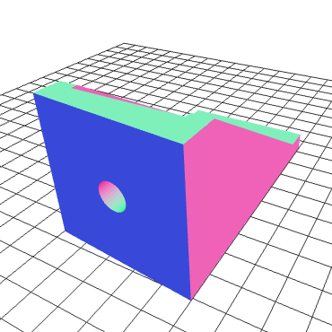

#3D Models - Physics 12 Nutball

###Folders:
1. blend - Blender files `.blend`
2. img - Images of the models
3. stl - Print-ready `.stl` files

###Current Models:

| # | Name | Files | Image | Notes
|--:|:-----:|:-------:|:------:|:-------
|1. | Control_Horn | [stl](stl/Control_Horn.stl) &#124; [blend](blend/Control_Horn.blend) |  | A replicate of the real object.
|2. | Motor_Mount | [stl](stl/Motor_Mount.stl) &#124; [blend](blend/Motor_Mount.blend) |  | -3&deg; alone `x`, +5&deg; alone `z`
