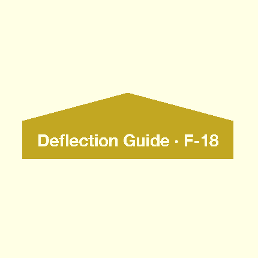

#3D Models - Physics 12 Airplane

###Folders:
1. blend - Blender files `.blend`
2. img - Images of the models
3. stl - Print-ready `.stl` files
3. scad - Designed in [OpenSCAD](http://www.openscad.org/) `.scad`

###Current Models:

| # | Name | Files | Image | Notes
|--:|:-----:|:-------:|:------:|:-------
|1. | Control Horn | [stl](stl/Control_Horn.stl) &#124; [blend](blend/Control_Horn.blend) |  | A replicate of the real object.
|2. | Motor Mount | [stl](stl/Motor_Mount.stl) &#124; [blend](blend/Motor_Mount.blend) |  | -5&deg; alone `x` (5&deg; down), +3&deg; alone `z` (3&deg; right)
|3. | Circular Motor Mount (SU-34) | [stl](stl/Circular_Motor_Mount.stl) &#124; [scad](scad/Circular_Motor_Mount.scad) |  | Motor Mount for the `SU-34` model plane. *Customizable on [Thingiverse](http://www.thingiverse.com/thing:707732)*
|4. | Deflection Guide (F-18) | [stl](stl/Deflection_Guide.stl) &#124; [scad](scad/Deflection_Guide.scad) |  | Foam Board Reference

Note: `.stl` files are also available on [Thingiverse](http://www.thingiverse.com/benz/collections/physics-12-airplane)
